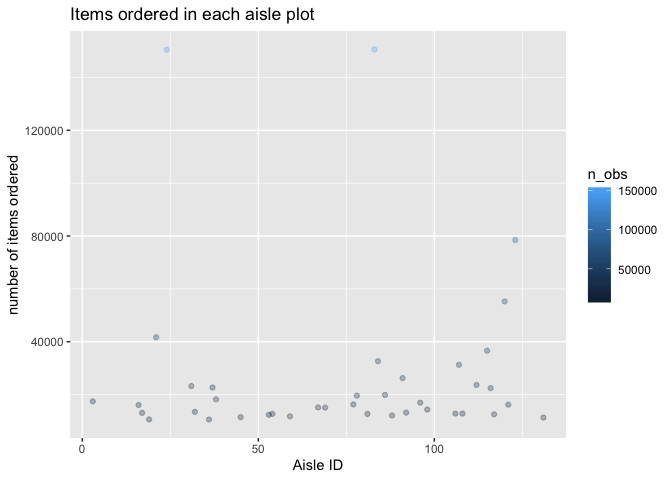
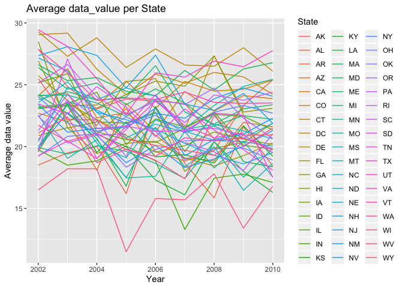
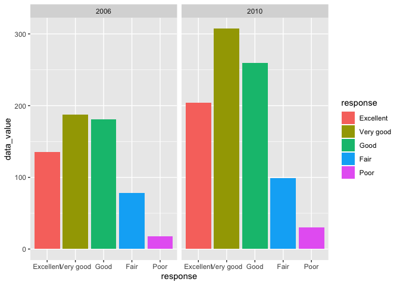
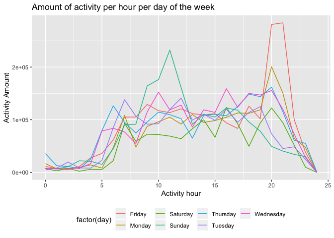

p8105\_hw3\_kzw2102
================
Kelly Wang
10/13/19

# Problem 1

  - how many aisles are there? Which aisles are the most important.
  - plot that shows number of items ordered in each aisle, limiting this
    to aisles with more than 10000 items ordered. Arrange aisles
    sensibly and organize plot so can read it \* table that shows most
    popular items in each of the aisles “baking ingredients”, “dog food
    care” and “packaged vegetables fruits”. (including number of times
    each item is ordered in your table)

<!-- end list -->

``` r
library(p8105.datasets)
data("instacart")
instacart %>% 
  janitor::clean_names()
```

    ## # A tibble: 1,384,617 x 15
    ##    order_id product_id add_to_cart_ord… reordered user_id eval_set
    ##       <int>      <int>            <int>     <int>   <int> <chr>   
    ##  1        1      49302                1         1  112108 train   
    ##  2        1      11109                2         1  112108 train   
    ##  3        1      10246                3         0  112108 train   
    ##  4        1      49683                4         0  112108 train   
    ##  5        1      43633                5         1  112108 train   
    ##  6        1      13176                6         0  112108 train   
    ##  7        1      47209                7         0  112108 train   
    ##  8        1      22035                8         1  112108 train   
    ##  9       36      39612                1         0   79431 train   
    ## 10       36      19660                2         1   79431 train   
    ## # … with 1,384,607 more rows, and 9 more variables: order_number <int>,
    ## #   order_dow <int>, order_hour_of_day <int>,
    ## #   days_since_prior_order <int>, product_name <chr>, aisle_id <int>,
    ## #   department_id <int>, aisle <chr>, department <chr>

``` r
# counting how many aisles there are 
instacart %>% 
  summarize(
     max(aisle_id)
  )
```

    ## # A tibble: 1 x 1
    ##   `max(aisle_id)`
    ##             <int>
    ## 1             134

``` r
#counting the aisles that are the most important : there are 134 aisles 
instacart %>% 
  count(aisle_id, name = "n_items")
```

    ## # A tibble: 134 x 2
    ##    aisle_id n_items
    ##       <int>   <int>
    ##  1        1    2936
    ##  2        2    3873
    ##  3        3   17449
    ##  4        4    9917
    ##  5        5    2905
    ##  6        6    1795
    ##  7        7    1526
    ##  8        8    1501
    ##  9        9    9736
    ## 10       10     448
    ## # … with 124 more rows

``` r
# another  way
instacart %>% 
  group_by(aisle_id) %>% 
  summarize(
    n_obs=n()
  )
```

    ## # A tibble: 134 x 2
    ##    aisle_id n_obs
    ##       <int> <int>
    ##  1        1  2936
    ##  2        2  3873
    ##  3        3 17449
    ##  4        4  9917
    ##  5        5  2905
    ##  6        6  1795
    ##  7        7  1526
    ##  8        8  1501
    ##  9        9  9736
    ## 10       10   448
    ## # … with 124 more rows

``` r
## to get the max
instacart %>% 
  add_count(aisle_id, name = "n_items") %>% 
  summarize(
    max(aisle_id, n_items)
)
```

    ## # A tibble: 1 x 1
    ##   `max(aisle_id, n_items)`
    ##                      <int>
    ## 1                   150609

``` r
# most frequent aisle has 150609 items in it -- aisle_id = 83. 
```

## plot that shows number of items ordered in each aisle, limiting this to aisles with more than 10000 items ordered.

``` r
instacart_plot = 
  instacart %>%
  group_by(aisle_id) %>% 
  summarize(
    n_obs=n()
  ) %>% 
  filter(n_obs > 10000)%>% 
  ggplot(aes(x=aisle_id, y=n_obs)) + 
  geom_point(aes(color=n_obs), alpha=0.3) + 
  labs(
    title = "Items ordered in each aisle plot",
    x = "Aisle ID",
    y= "number of items ordered"
  ) 

instacart_plot
```

<!-- -->

## table that shows the three most popular in each of the aisles “baking ingredients”, “dog food care”, “packaged vegetables fruits”

``` r
top_three_df=
  instacart %>% 
  group_by(aisle, product_name, product_id) %>% 
  summarize(
    count_prod=n()
  ) %>% filter(
    aisle %in% c("baking ingredients","dog food care", "packaged vegetables fruits")
  ) %>% 
  group_by(aisle) %>% 
  top_n(3, count_prod) %>% 
  arrange(desc(count_prod)) %>% 
  rename("Product Name" = product_name, "Product ID" = product_id, "Number of times ordered"= count_prod) %>% 
  knitr::kable()

top_three_df
```

| aisle                           | Product Name                                    |  Product ID | Number of times ordered |
| :------------------------------ | :---------------------------------------------- | ----------: | ----------------------: |
| packaged vegetables fruits      | Organic Baby Spinach                            |       21903 |                    9784 |
| packaged vegetables fruits      | Organic Raspberries                             |       27966 |                    5546 |
| packaged vegetables fruits      | Organic Blueberries                             |       39275 |                    4966 |
| baking ingredients              | Light Brown Sugar                               |       23537 |                     499 |
| baking ingredients              | Pure Baking Soda                                |       23405 |                     387 |
| baking ingredients              | Cane Sugar                                      |       49533 |                     336 |
| dog food care                   | Snack Sticks Chicken & Rice Recipe Dog Treats   |         722 |                      30 |
| dog food care                   | Organix Chicken & Brown Rice Recipe             |       23329 |                      28 |
| dog food care                   | Small Dog Biscuits                              |       17471 |                      26 |
| \#\# table for mean hour of day | at which Pink Lady Apples and Coffe Ice Cream w | ere ordered |                         |

``` r
mean_hour_df=
instacart %>% 
  filter(product_name %in% c("Pink Lady Apples", "Coffee Ice Cream")) %>% 
  select(product_name, order_dow, order_hour_of_day) %>% 
  group_by(product_name, order_dow) %>% 
  summarize(
    mean_order_hour=mean(order_hour_of_day)
  ) %>%  
  mutate(
    order_dow = recode(order_dow, '1' = "Monday", '2'= "Tuesday", '3' = "Wednesday", '4'= "Thursday", '5'="Friday", '6'="Saturday", '0'="Sunday")
  ) %>% 
  pivot_wider(
    names_from=order_dow,
    values_from=mean_order_hour
  )  %>% 
knitr::kable(digits=2)

mean_hour_df
```

| product\_name    | Sunday | Monday | Tuesday | Wednesday | Thursday | Friday | Saturday |
| :--------------- | -----: | -----: | ------: | --------: | -------: | -----: | -------: |
| Coffee Ice Cream |  13.77 |  14.32 |   15.38 |     15.32 |    15.22 |  12.26 |    13.83 |
| Pink Lady Apples |  13.44 |  11.36 |   11.70 |     14.25 |    11.55 |  12.78 |    11.94 |

In this dataset, there are 1384617 rows and 15 variables/columns.There
are a total of 134 aisles, where aisle 83, also known as “Fresh
vegetables” contains the most amount of items, which is (150,609 items).
Majority of the aisles have under 4000 products, based off of the plot.
The most common items in the “baking ingredients” category are light
brown sugar, cane sugar, and baking soda. For the “packaged vegetables
fruits” category, the most common items are organic baby spinach,
organic raspberries, and organic blueberries. For the category “dog food
care”, the most common items are snack sticks chicken & rice recipe dog
treats, organix chicken & brown rice recipe, and small dog biscuits. The
following table displas the average hour the products“pink lady apple”
and “coffee ice cream” were ordered.

# Question 2

``` r
library(p8105.datasets)
data("brfss_smart2010")
```

### cleaning the data

``` r
brfss_df=
  brfss_smart2010 %>% 
  janitor::clean_names() %>% 
  rename(location_abbr=locationabbr, location_desc=locationdesc, resp_id=respid) %>%
  filter(topic=="Overall Health", response %in% c("Excellent", "Very good","Good", "Fair", "Poor")) %>% 
  mutate(
    response=as.character(response),
    response = factor(response, levels=c("Excellent", "Very good","Good", "Fair", "Poor"))
  )
```

### in 2002, which states observed 7 or more locations?

``` r
brfss_df %>% 
  filter(year==2002) %>% 
  group_by(location_abbr) %>%  #groups by different states
  distinct(location_desc) %>%  #counts numbero of unique 
  summarize(
    n_locations=n()
  ) %>% 
  filter(n_locations >= 7) %>% 
  knitr::kable()
```

| location\_abbr | n\_locations |
| :------------- | -----------: |
| CT             |            7 |
| FL             |            7 |
| MA             |            8 |
| NC             |            7 |
| NJ             |            8 |
| PA             |           10 |

### in 2010, which states were observed at 7 or more locations?

``` r
brfss_df %>% 
  filter(year==2010) %>% 
  group_by(location_abbr) %>% 
  distinct(location_desc) %>% 
  summarize(
    n_locations=n()
  ) %>% 
  filter(n_locations >= 7) %>% 
  knitr::kable()
```

| location\_abbr      | n\_locations |
| :------------------ | -----------: |
| CA                  |           12 |
| CO                  |            7 |
| FL                  |           41 |
| MA                  |            9 |
| MD                  |           12 |
| NC                  |           12 |
| NE                  |           10 |
| NJ                  |           19 |
| NY                  |            9 |
| OH                  |            8 |
| PA                  |            7 |
| SC                  |            7 |
| TX                  |           16 |
| WA                  |           10 |
| \#\#\# Excellent ta |          ble |

``` r
brfss_excellent_df=
  brfss_df %>% 
  filter(response=="Excellent") %>% 
  select(year, location_abbr, location_desc, data_value) %>% 
  group_by(location_abbr, year) %>% 
  summarize(
    average_data_value= mean(data_value)
  )

## spaghetti plot
brfss_excellent_plot=
  brfss_excellent_df %>% 
  ggplot(aes(x=year, y=average_data_value, color=location_abbr))+ geom_line()+
  labs(
    title="Average data_value per State",
    x = "Year",
    y = "Average data value",
    color = 'State'
  )

brfss_excellent_plot
```

    ## Warning: Removed 3 rows containing missing values (geom_path).

<!-- -->

### two panel plot that shows the distribution of of data\_value responses among locations in NY State

``` r
##panels you use patchwork
plot2006_2010= 
brfss_df %>% 
  filter(year%in%c("2006", "2010"), location_abbr== "NY") %>% 
  ggplot(aes(x=response, y=data_value, fill=response)) + 
  geom_col() +
  facet_grid(~year)

plot2006_2010
```

<!-- --> In
this dataset we have 10625 rows and 23 variables. In the year 2002, the
states that have more than 7 locations were the following: Connecticut,
Florida, Massachusetts, North Carolina, New Jersey, and Pennsylvania. In
2010, the following states had more than 7 locations: California,
Colorado, Florida, Massachusetts, Maryland, North Carolina, Nebraska,
New Jersey, New York, Ohio, Penssylvania, South Carolina, Texas, and
Washington.

# Problem 3

``` r
accel_data=
  read_csv(file="./accel_data.csv")
```

    ## Parsed with column specification:
    ## cols(
    ##   .default = col_double(),
    ##   day = col_character()
    ## )

    ## See spec(...) for full column specifications.

``` r
# tidy the data
accel_tidy_data=
  accel_data %>% 
  janitor::clean_names() %>% 
  pivot_longer(
    activity_1:activity_1440,
    names_to="activity_minute",
    values_to = "activity_amount"
  ) %>% 
  mutate(
    type = if_else(day == c("Saturday", "Sunday"), "weekend", "weekday"),
    activity_minute = str_replace(activity_minute, "activity_", ""),
    activity_minute=as.numeric(activity_minute)
  )

#counting how many entries: 50400
accel_tidy_data %>% 
  summarize(
    count_obs=n()
  )
```

    ## # A tibble: 1 x 1
    ##   count_obs
    ##       <int>
    ## 1     50400

In this dataset, there are 50400 rows and 6 columns/variables. These
variables include week number, day of the the week, activity minute,
activity amount, and whether it was a weekday or weekend.

## creating a total activity per each day

``` r
accel_tidy_data %>% 
  group_by(week,day) %>% 
  summarize(
    sum_activity=sum(activity_amount),
  ) %>% 
  knitr::kable()
```

|    week | day          |                                                             sum\_activity |
| ------: | :----------- | ------------------------------------------------------------------------: |
|       1 | Friday       |                                                                 480542.62 |
|       1 | Monday       |                                                                  78828.07 |
|       1 | Saturday     |                                                                 376254.00 |
|       1 | Sunday       |                                                                 631105.00 |
|       1 | Thursday     |                                                                 355923.64 |
|       1 | Tuesday      |                                                                 307094.24 |
|       1 | Wednesday    |                                                                 340115.01 |
|       2 | Friday       |                                                                 568839.00 |
|       2 | Monday       |                                                                 295431.00 |
|       2 | Saturday     |                                                                 607175.00 |
|       2 | Sunday       |                                                                 422018.00 |
|       2 | Thursday     |                                                                 474048.00 |
|       2 | Tuesday      |                                                                 423245.00 |
|       2 | Wednesday    |                                                                 440962.00 |
|       3 | Friday       |                                                                 467420.00 |
|       3 | Monday       |                                                                 685910.00 |
|       3 | Saturday     |                                                                 382928.00 |
|       3 | Sunday       |                                                                 467052.00 |
|       3 | Thursday     |                                                                 371230.00 |
|       3 | Tuesday      |                                                                 381507.00 |
|       3 | Wednesday    |                                                                 468869.00 |
|       4 | Friday       |                                                                 154049.00 |
|       4 | Monday       |                                                                 409450.00 |
|       4 | Saturday     |                                                                   1440.00 |
|       4 | Sunday       |                                                                 260617.00 |
|       4 | Thursday     |                                                                 340291.00 |
|       4 | Tuesday      |                                                                 319568.00 |
|       4 | Wednesday    |                                                                 434460.00 |
|       5 | Friday       |                                                                 620860.00 |
|       5 | Monday       |                                                                 389080.00 |
|       5 | Saturday     |                                                                   1440.00 |
|       5 | Sunday       |                                                                 138421.00 |
|       5 | Thursday     |                                                                 549658.00 |
|       5 | Tuesday      |                                                                 367824.00 |
|       5 | Wednesday    |                                                                 445366.00 |
| It appe | ars that the | most activity tends to be on Mondays and the least activity on Saturdays. |

## single-panel plot

``` r
accel_plot=
  accel_tidy_data %>% 
  mutate(
    hour=activity_minute%/%60
  ) %>% 
  group_by(day,hour) %>% 
  summarize(sum_activity=
    sum(activity_amount),
  ) %>% 
  ggplot(aes(x=hour, y=sum_activity, color=day))+ geom_line()+
  labs(
    title="Amount of activity per hour per day of the week",
    x = "Activity hour",
    y = "Activity Amount",
    color = 'Per Day'
  ) +
  theme(legend.position="bottom")

accel_plot = accel_plot + aes(colour=factor(day))
accel_plot
```

<!-- -->
Based off of this, we can see that on Fridays, the most amount of
activity are typically towards the end of the day, whereas on Sundays it
is in the middle of the day.
